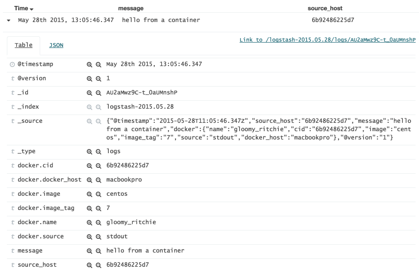

# logspout-redis-logstash
[Logspout](https://github.com/gliderlabs/logspout) adapter for writing Docker container stdout/stderr logs to Redis in Logstash jsonevent layout.

See the example below for more information.


## Docker image available

Logspout including this adapter is available on [Docker Hub](https://registry.hub.docker.com/u/rtoma/logspout-redis-logstash/). Pull it with:

```
$ docker pull rtoma/logspout-redis-logstash
```

## How to use the Docker image

```
$ docker run -d --name logspout /var/run/docker.sock:/var/run/docker.sock:ro rtoma/logspout-redis-logstash redis://<your-redis-server>
```

## Configuration

Some configuration can be passed via container environment keys. Some can be appended as query parameters to the endpoint.


### Environment keys

Behaviour of the adapter can be changed by passing configuration via docker environment vars (e.g. -e key=val).

- DEBUG=1: will enable logspout debug mode (default is disabled);
- REDIS\_PASSWORD=\<password\>: will force the adapter to do an AUTH to Redis (default is none);
- REDIS\_KEY=\<key\>: will configure the Redis list key to add events to (default is 'logspout');
- REDIS\_DOCKER\_HOST=\<host\>: will add a docker.host=<host> field, allows you to add the hostname of your docker host, identifying where your container was running (think mesos cluster);
- REDIS\_USE\_V0\_LAYOUT=1: logstash jsonevent layout v0 will be used (default is v1 layout).
- REDIS\_LOGSTASH\_TYPE=json-log: logstash type/message parser.

### Endpoint query parameters

Two keys can also be set as endpoint query parameters.

The REDIS\_KEY can be set as redis://host?key=\<key\>.

The REDIS\_USE\_V0\_LAYOUT switch can be set with ?use\_v0\_layout=1


## ELK integration

Try out logspout with redis-logstash adapter in a full ELK stack. A docker-compose.yml can be found in the example/ directory.

When logspout with adapter is running. Executing something like:

```
docker run --rm centos:7 echo hello from a container
```

Will result in a corresponding event in Elasticsearch. Below is a screenshot from Kibana4:




## Credits

Thanks to [Gliderlabs](https://github.com/gliderlabs) for creating Logspout!

For other credits see the header of the redis.go source file.
